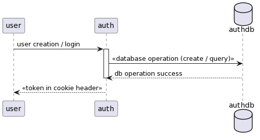
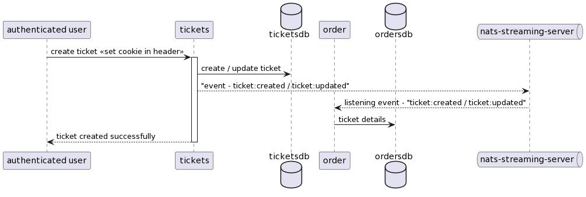
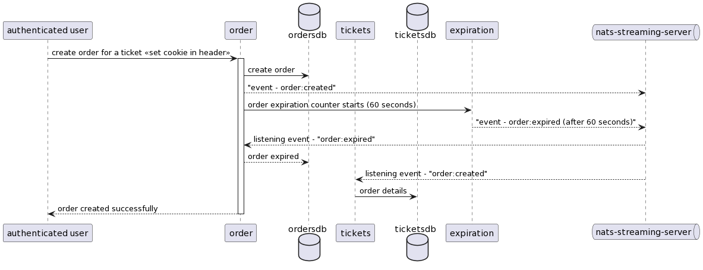

# Microservices Testing application

## Objective

Traditionally, we use opensource software as the system under test (SUT) to conduct evaluations and proof of concept experiments. While that accomplishes the goal, we have seen that there may not always be adequate support or that the application may have become obsolete over time. Because of this, we have to restructure or perhaps rebuild the artefacts we have created that point to those applications.
The goal is to create an application that we can use to test theories and evaluate applications that we support. As a result, we can be certain that it will always function and can be adjusted to meet our needs.

## General requirements

- Install a git client such as [git bash](https://git-scm.com/downloads)

- Latest version of [Node.js](https://nodejs.org/en/download/)

- [Docker](https://mantelgroup.atlassian.net/wiki/spaces/CMD/pages/4343824385/Docker)

- Docker compose

## Clone the repository:

```bash
git clone git@github.com:rijuvijayan87/learn-to-build-microservices-ticketing-app.git
```

## Testing

Unit and integration tests are written for each service in order to test it. Either the script at the project `root` (example: `npm run test:auth`) or npm scripts in the individual projects can be used to perform tests (e.g. auth, ticket, orders)

## Starting services

From the `root` of the project run the following command

```bash
    docker-compose up
```

## Services

| No. | Service        | URI                                            |
| --- | -------------- | ---------------------------------------------- |
| 1   | auth-service   | [http://localhost:3001](http://localhost:3001) |
| 2   | ticket-service | [http://localhost:3002](http://localhost:3002) |
| 3   | order-service  | [order-service:3003](http://localhost:3003)    |

## Sequence diagrams

### Auth service



### Ticket service



### Order service



## Plantuml Diagrams

### Auth service

```bash
@startuml
participant user
participant auth
database    authdb                   as adb

user -> auth : user creation / login
activate auth

auth -> adb: << database operation (create / query) >>
adb --> auth: db operation success
deactivate auth

auth --> user : << token in cookie header >>

@enduml
```

### Ticket service

```bash
@startuml
participant "authenticated user" as  user

participant tickets
database    ticketsdb                as tdb

participant order

database    ordersdb                 as odb
queue       "nats-streaming-server"  as nats

user -> tickets : create ticket << set cookie in header >>
activate tickets

tickets -> tdb : create / update ticket
tickets --> nats: "event - ticket:created / ticket:updated"
nats --> order : listening event - "ticket:created / ticket:updated"

order -> odb : ticket details

tickets --> user: ticket created successfully
deactivate tickets

@enduml
```

### Order Service

```bash
@startuml
participant "authenticated user" as  user

participant order

database    ordersdb                 as odb

participant tickets
database    ticketsdb                as tdb

participant expiration

queue       "nats-streaming-server"  as nats

user -> order : create order for a ticket << set cookie in header >>
activate order

order -> odb : create order
order --> nats: "event - order:created"
order -> expiration: order expiration counter starts (60 seconds)
expiration --> nats: "event - order:expired (after 60 seconds)"
nats --> order : listening event - "order:expired"
order --> odb: order expired
nats --> tickets : listening event - "order:created"

tickets -> tdb : order details

order --> user: order created successfully
deactivate order

@enduml
```
